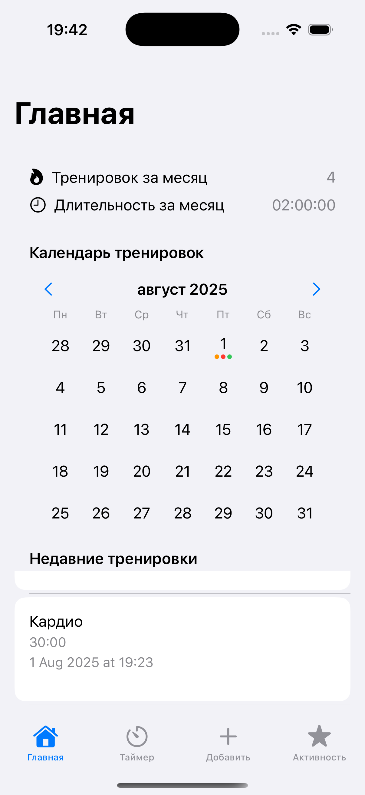
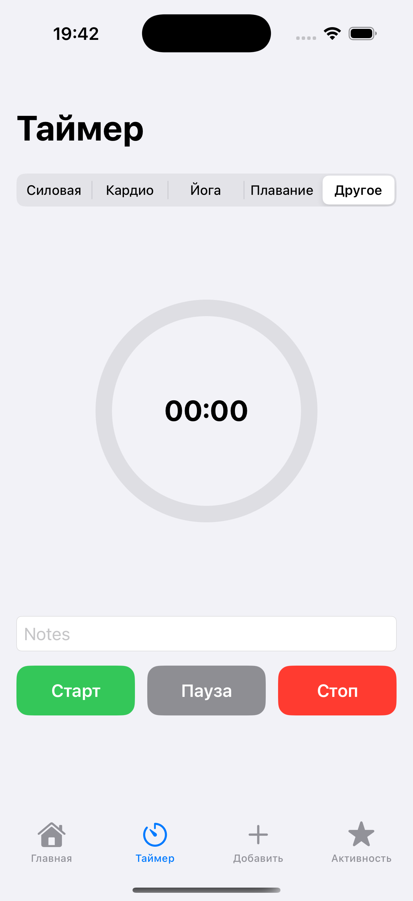
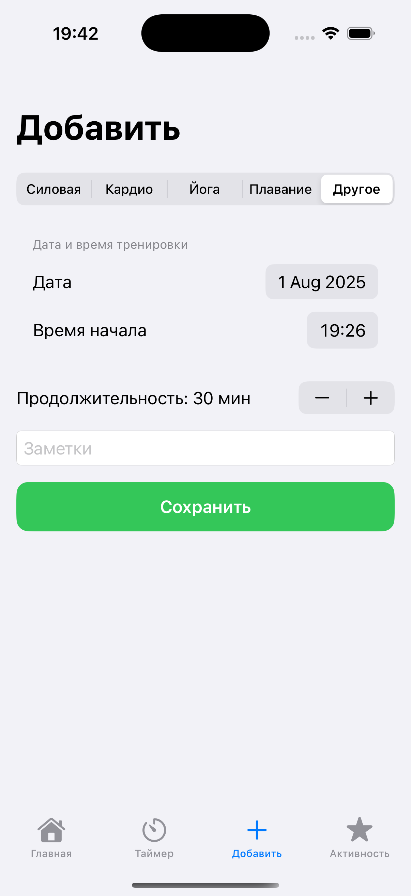
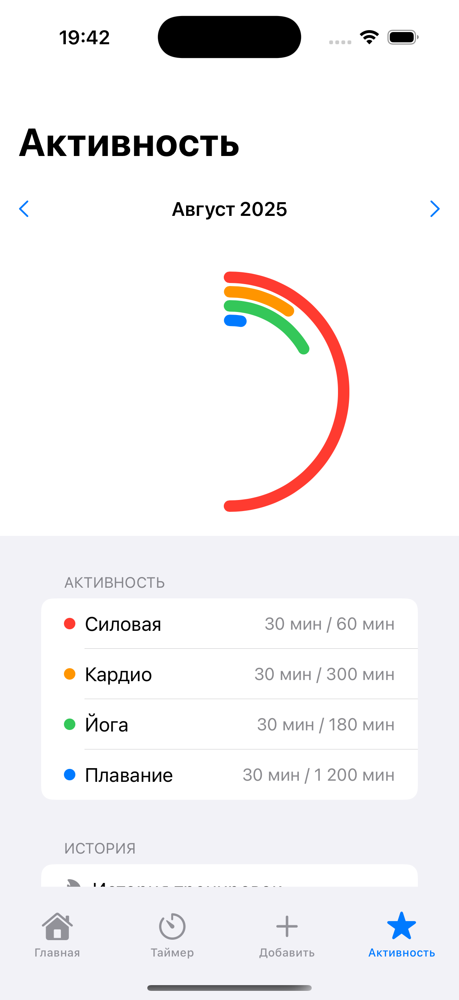

# SportTimer – SwiftUI приложение для отслеживания тренировок
---

## Архитектурные решения

- **SwiftUI + MVVM**: раздельные `View`, `ViewModel`, `Model`-слои для тестируемости и читаемости.
- **Core Data**: для хранения тренировок и обеспечения работы без интернета.
- **Модульный подход**: каждый экран изолирован и имеет свой `ViewModel`.
- **UserDefaults**: для хранения настроек (звук, имя пользователя).
- **AVFoundation**: для воспроизведения звуков при действиях с таймером.
- **UNUserNotificationCenter**: для отправки локальных уведомлений по окончании тренировки.
- **Многопоточность**: использование `Task`, `MainActor`, `DispatchQueue` для плавного UI и фоновой работы.
---

## Скриншоты

| Главная | Таймер | Добавить | Активность |
|------|-------|---------|---------|
|  |  |  |  |

---
